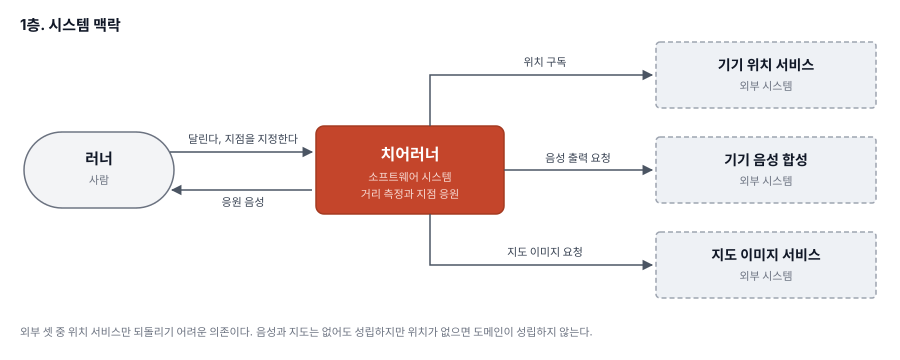
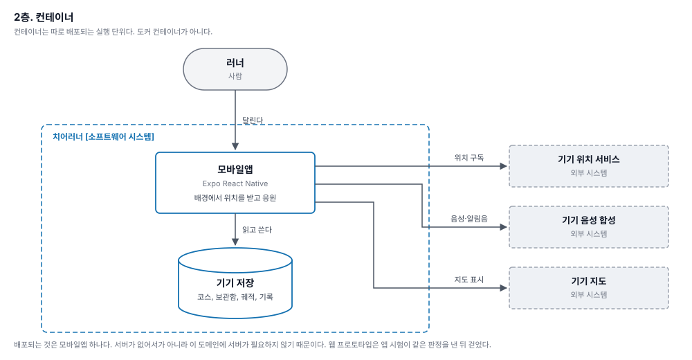

# 아키텍처

## 전제

이 시스템이 다루는 도메인은 하나다. **러너가 한 번의 달리기에서 시작부터 종료까지의 거리를 측정하고, 그 사이에 응원받고 싶은 위치를 지정해 두었다면 그곳에서 응원받는 것.** 정의와 모델은 [DOMAIN.md](DOMAIN.md) 에 있다.

작성자는 코드를 읽지 않는다. 그래서 **사람이 코드 검토로 검출하던 것을 기계가 검출해야 한다.** 이 문서의 절반은 계층 설계이고 절반은 그 강제 장치다. 장치 없는 계층 규칙은 두 번째 세션에 무너진다.

## 그리는 방식

[C4 model](https://c4model.com/) 의 층을 쓴다. 층마다 축척이 다르고, 한 그림에 두 축척을 담지 않는다.

| 층 | 그리는 것 | 이 문서에서 |
|---|---|---|
| 1 시스템 맥락 | 시스템 하나와 그것을 쓰는 사람·외부 시스템 | 아래 |
| 2 컨테이너 | **따로 배포되는 단위** | 아래 |
| 3 컴포넌트 | 컨테이너 안의 구성 요소와 책임 | 아래 |
| 4 코드 | 클래스·함수 | 그리지 않는다. [DOMAIN.md](DOMAIN.md) 가 대신한다 |

C4 의 컨테이너는 도커 컨테이너가 아니라 따로 배포되는 실행 단위다. 이 구분이 이 문서에 없어서 문제가 생겼다. **계층 그림은 컨테이너 한 개 «안» 의 이야기라서, 컨테이너가 몇 개인지 드러나지 않는다.** 그래서 웹과 앱이 같은 도메인을 각자 구현하고 있는 상태가 문서에 보이지 않았다.

그림은 `docs/diagrams/` 에 SVG 로 둔다. 배치를 직접 정하므로 라벨이 겹치지 않고, 텍스트 파일이라 변경이 diff 에 잡힌다.

그림과 표를 함께 둔다. 그림은 관계를 한눈에 보여주고, 표는 검색되며 세부를 담는다. 둘 중 하나만 두면 각각이 못 하는 일이 남는다.

## 1층. 시스템 맥락



| 요소 | 유형 | 책임 | 치어러너와의 관계 |
|---|---|---|---|
| 러너 | 사람 | 달리고, 지점을 지정하고, 응원을 받는다 | 달린다, 지점을 지정한다 ↔ 응원 음성을 받는다 |
| 치어러너 | 소프트웨어 시스템 | 거리를 측정하고 지정한 지점에서 응원한다 | (이 시스템) |
| 기기 위치 서비스 | 외부 시스템 | 위치를 준다 | 치어러너 → 구독한다 |
| 기기 음성 합성 | 외부 시스템 | 문장을 소리로 바꾼다 | 치어러너 → 음성 출력을 요청한다 |
| 지도 이미지 서비스 | 외부 시스템 | 배경 지도를 준다 | 치어러너 → 지도 이미지를 요청한다 |


외부 시스템 셋 중 **위치 서비스만 되돌리기 어려운 의존**이다. 음성과 지도는 없어도 앱이 성립하지만 위치가 없으면 도메인 자체가 성립하지 않는다.

## 2층. 컨테이너



| 컨테이너 | 기술 | 책임 | 배포되는 곳 | 무엇을 부르나 |
|---|---|---|---|---|
| 모바일앱 | Expo React Native | 배경에서 위치를 받고 응원한다 | 스토어와 기기 | 기기 저장, 위치 서비스, 음성 합성 |
| 웹 프로토타입 | 단일 HTML | 로직 확인. 배경 위치는 불가 | 호스팅 | 기기 저장, 위치 서비스(화면이 켜진 동안만), 배포 함수, 지도 이미지 서비스 |
| 배포 함수 | 서버리스 함수 | 버전 알림과 로그 수집 | 그 호스팅의 실행 환경 | 없음 |
| 기기 저장 | 기기 내 저장 | 코스, 궤적, 진단 기록 | 기기 | 없음 |

러너는 모바일앱과 웹 프로토타입을 직접 쓴다. 나머지 둘은 그 뒤에 있다.

컨테이너를 넷으로 두는 근거는 **따로 배포되기 때문**이다. 앱은 스토어와 기기로, 웹은 호스팅으로, 함수는 그 호스팅의 실행 환경으로 각각 나간다.

### 웹이 왜 아직 있나

익스팬드 전략이다. 앱을 만드는 동안 로직 확인은 웹에서 한다. 자동 시험이 웹 페이지를 대상으로 돌기 때문에 웹을 먼저 정리하면 시험도 함께 사라진다. 정리 시점은 앱 쪽 시험이 같은 표본으로 같은 판정을 낼 때다. 절차는 [MVP.md](MVP.md).

### 지금 이 그림이 드러내는 문제

**도메인 로직이 앱과 웹 안에 각각 있다.** 같은 규칙을 두 곳에서 구현하고 있고, 규칙이 바뀌면 두 곳을 고쳐야 한다. 한쪽만 고치는 실수가 반드시 나온다.

목표 상태는 도메인이 두 컨테이너가 공유하는 하나의 모듈인 것이다. 공유 모듈은 따로 배포되지 않으므로 컨테이너가 아니라 3층의 구성 요소다.

| | 도메인 로직이 있는 곳 | 규칙이 바뀌면 |
|---|---|---|
| 지금 | 모바일앱 안, 웹 안 (각각) | 두 곳을 고쳐야 한다 |
| 목표 | 두 컨테이너가 공유하는 모듈 하나 | 한 곳만 고친다 |

| 요소 | 담는 것 | 무엇을 부르나 |
|---|---|---|
| 모바일앱 | 화면과 어댑터만 | 도메인 모듈 |
| 웹 프로토타입 | 화면과 어댑터만 | 도메인 모듈 |
| 도메인 모듈 | 값 객체, 집합체, 정책 | 없음. 프레임워크를 모른다 |

이 이관이 끝나기 전까지 [DOMAIN.md](DOMAIN.md) 가 두 구현의 유일한 계약이다.

## 3층. 컴포넌트

여기부터는 **모바일앱 컨테이너 안**의 이야기다.

```
presentation  ──>  application  ──>  domain
      │                 │              ↑
      └─────────────────┴──> infrastructure
                                (포트 구현체)
```

의존은 안쪽으로만 흐른다. `domain` 은 아무것도 모른다.

| 계층 | 담는 것 | 의존 가능 범위 |
|---|---|---|
| `domain` | 값 객체, 집합체, 정책, 사건 | 없음. 표준 내장 함수만 |
| `application` | 유스케이스, 포트 선언 | `domain` |
| `infrastructure` | 포트 구현체 | `domain`, `application` |
| `presentation` | 화면, 입력 | `application` |

`domain` 이 `expo-location` 에 의존하면 그 순간 시험 비용이 실기기로 돌아간다. 그래서 이 한 줄이 나머지 규칙보다 중요하다.

### 포트

`application` 이 필요를 선언하고 `infrastructure` 가 채운다.

인터페이스마다 구현체를 둘 둔다. 운영용과 시험 대역이고, 백엔드에서 하던 그대로다.

| 포트 (인터페이스) | 하는 일 | 운영 구현체 | 시험 대역 |
|---|---|---|---|
| `LocationPort` | 위치 구독 시작·중지, 서비스 여부, 위치 한 건 | `ExpoLocationAdapter` | `fakeLocation` |
| `SpeechPort` | 음성 출력과 그 결과 | `ExpoSpeechAdapter` | `fakeSpeech` |
| `CuePort` | 조작 확인 알림음 | `ExpoCueAdapter` | `fakeCue` |
| `NetworkPort` | 인터넷에 닿는가, 바뀌면 알림 | `ExpoNetworkAdapter` | `fakeNetwork` |
| 저장 | 코스·보관함·달리기 기록·진단 기록 | `CourseStore` · `SessionStore` · `FileTrace` (파일) | `fakeStore` · `fakeSession` · `fakeTrace` |
| 시계 | 현재 시각 | 주입한 `Date.now` | `fakeClock` |

시계를 포트 인터페이스로 두지 않고 함수 하나를 주입한다. 되돌려 주는 값이 숫자 하나뿐이라 인터페이스를 둘 이유가 없다. 그래도 주입은 한다. 도메인이 `Date.now()` 를 직접 부르면 틱 경계·결손 판정·무이동 판정 시험을 짤 수 없다.

`SpeechPort` 는 결과를 되돌려 준다. 부르고 끝나는 함수로 두면 부른 사실만 남고 재생됐는지는 알 수 없다. 웹 프로토타입이 그 틈에 빠졌고, 이 앱도 처음에 같은 자리에 빠졌다.

지도는 포트로 두지 않는다. 화면이 직접 쓰고 도메인과 응용 계층은 지도를 모른다. 좌표를 받아 지점을 지정하는 것은 코스의 행위이고, 그 좌표가 지도에서 왔는지는 코스가 알 필요가 없다.

알림도 두지 않는다. 배경에서 음성이 끝까지 재생되는 것을 확인했으므로 응원은 알림 없이 성립한다. 근거는 [#5](https://github.com/idean3885/cheer-runner/issues/5) 에 남겼다.

#### 포트 모양은 프로토타입에서 확정했다

이 표를 추상으로 두지 않기 위해, 프로토타입에서 플랫폼 호출을 창구 넷으로 실제로 모아봤다. 흩어진 호출 42개가 어떤 함수로 수렴하는지가 이때 나왔다.

| 창구 | 모은 호출 수 | 확정된 함수 | 대응 포트 |
|---|---|---|---|
| `store` | 24 | `get` `getJSON` `set` `setJSON` `remove` | `CourseRepository` |
| `geo` | 7 | `supported` `once` `watch` `unwatch` | `LocationPort` |
| `notif` | 6 | `permission` `request` `show` | 없음. 앱은 알림을 쓰지 않는다 |
| `voice` | 5 | `supported` `say` `stop` | `SpeechPort` |

세 가지를 배웠다.

**쓰기 성공 여부를 돌려줘야 한다.** 저장 실패 시 오래된 경로를 밀어내고 다시 시도하는 호출자가 있었다. 참·거짓을 돌려주지 않으면 그 재시도를 쓸 수 없다.

**권한은 상태 문자열로 돌려준다.** 값이 넷이다. `granted`, `denied`, `default`, `absent` 다. `absent` 는 API 자체가 없는 경우이고, 웹에서는 홈 화면에 추가하지 않으면 여기 해당한다. 참·거짓으로 줄이면 부르는 쪽이 "권한을 물어볼 수 있는가" 와 "물어볼 수단조차 없는가" 를 구분하지 못한다.

**구독 표는 불투명한 값으로 다룬다.** 브라우저는 숫자를 주지만 플러그인이 무엇을 줄지 모른다. 숫자로 명시하면 어댑터를 교체할 때 호출부가 따라 바뀐다.

창구 밖에서 플랫폼 API 를 직접 부르는 것은 원본 검사로 막는다. 이름을 가리는 지역 변수도 함께 막는다. 실제로 `notify(title, body, voice)` 의 세 번째 인자가 음성 창구를 가리고 있었다. 조용히 깨지는 종류라서 사람이 찾기 어렵다.

그리고 이 규칙 덕에 **재생 배속이 계산 결과를 바꾸지 않는다.** 위치의 시각은 고정 표본에서 오고 도메인은 벽시계를 읽지 않으므로, 20분 달리기를 밀리초에 흘려도 같은 값이 나온다. 근거는 [ADR 0004](adr/0004-replay-adapter.md).

#### 어댑터 내부는 포트를 교체해도 시험되지 않는다

포트를 교체하면 그 **위**는 전부 시험되는데 운영 어댑터 **안**은 한 번도 돌지 않는다. 플랫폼이 준 객체를 도메인 값으로 옮기는 코드가 시험 밖에 남는다. 선행 검증에서 이 종류가 났다. 속도 필드를 쓰는 판단은 맞았는데 값이 없을 때 처리가 갈렸다.

그래서 위치 어댑터를 둘로 가른다.

| 조각 | 성격 | 시험 |
|---|---|---|
| `toFix(플랫폼 객체) → Fix` | 순수 함수 | CI 단위 시험 |
| `ExpoLocationAdapter` | 구독 시작·중지, 백그라운드 작업 등록 | 기기에서만 |

매핑을 순수 함수로 분리하면 기기에서만 확인할 수 있는 부분이 구독 기계 장치 몇 줄로 줄어든다. 그 몇 줄은 [MVP.md](MVP.md) 의 0 단계에서 걸러진다.

## 4층. 코드

그리지 않는다. 클래스와 함수 수준의 그림은 코드와 가장 빨리 어긋나고, 이 프로젝트에서 그 자리를 [DOMAIN.md](DOMAIN.md) 가 채운다. 집합체가 갖는 행위와 불변식이 거기 적혀 있다.

## 기계 강제 장치

코드 검토를 대신하는 자리다. 모두 CI 에서 돌고, 하나라도 실패하면 머지되지 않는다.

| 층 | 장치 | 막는 것 |
|---|---|---|
| 타입 | TypeScript `strict` + `noUncheckedIndexedAccess` + `exactOptionalPropertyTypes` | 배열 접근 뒤 `undefined`, 선택 속성 오용 |
| 타입 우회 | `@typescript-eslint/no-explicit-any`: error | `any` 로 검사를 끄는 것 |
| 계층 | `dependency-cruiser` 규칙 | `domain` 이 프레임워크에 의존하는 것 |
| 함수 크기 | eslint `complexity` 10, `max-depth` 3, `max-lines-per-function` 40, `max-params` 3 | PoC 의 `closeTick` 같은 다역 함수 |
| 파일 크기 | eslint `max-lines` 300 | 1,900줄 한 파일의 재발 |
| 조용한 실패 | `no-empty` + `@typescript-eslint/no-unused-vars` | 빈 `catch {}` 로 오류를 삼키는 것 |
| 도메인 정확성 | Vitest 단위 시험, `domain` 커버리지 하한 90% | 페이스·거리·구간 템포 회귀 |
| 모의 주입 경계 | 재생 어댑터는 **플랫폼이 주는 모양 그대로** 넣는다. `dependency-cruiser` 로 도메인 값 객체 직접 주입을 막는다 | 어댑터 매핑 버그가 모든 시험을 통과하는 것 |
| 경계 조건 | 합성 표본 (일정 속도·급감속·15초 결손·정확도 200m 잡음·652초 단절) | 실제 달리기에서만 드러나던 결함 |
| 서식 | Prettier | 서식 논쟁 |
| 이력 | ops-agent `flow` (이슈 → PR) | 이력 없는 변경 |

커버리지 하한을 `domain` 에만 거는 이유가 있다. 화면 커버리지는 숫자만 올라가고 뜻이 없다. 정확성이 걸린 곳은 순수 함수뿐이다.

## 쓰는 패턴

패턴 이름만 적으면 목록이고, 목록에는 판단이 없다. 그래서 셋을 함께 적는다. **막는 문제 · 검토한 대안 · 그 대안을 버린 근거.**

### 값 객체

| 항목 | 내용 |
|---|---|
| 막는 문제 | PoC 에서 미터·초당미터·초당킬로미터가 모두 `number` 였고 서로를 잘못 먹는 계산이 났다 |
| 대안 | 원시값 + 이름 규칙 (`distM`, `speedMps`) |
| 버린 근거 | 이름 규칙은 컴파일러가 검사하지 않는다. 규칙을 어긴 한 줄이 통과한다 |

### 상태 기계

| 항목 | 내용 |
|---|---|
| 막는 문제 | 종료된 달리기에 위치가 더 들어오는 것 |
| 대안 | 불린 표시 (`isRunning`) 로 분기 |
| 버린 근거 | 불린은 전이를 표현하지 못한다. 어떤 경로로 그 값이 됐는지 모르므로 «종료 뒤에는 바뀌지 않는다» 를 지킬 수 없다 |

### 순수 접기 연산(fold)

| 항목 | 내용 |
|---|---|
| 막는 문제 | 계산 정확성 확인이 실기기 달리기로만 가능했던 것 |
| 대안 | 가변 상태 객체를 두고 위치마다 갱신 |
| 버린 근거 | 중간 상태가 밖에서 바뀔 수 있으면 같은 입력이 같은 출력을 내지 않는다. 시험이 재현되지 않는다 |

근거는 [ADR 0002](adr/0002-domain-as-pure-fold.md).

### 포트와 어댑터

| 항목 | 내용 |
|---|---|
| 막는 문제 | 화면과 시험이 플랫폼 응답에 묶여 실기기 없이는 아무것도 확인하지 못하는 것 |
| 대안 | 계층 안에서 플랫폼 모듈을 직접 부르고 시험에서 모듈을 가로채기 |
| 버린 근거 | 가로채기는 모듈 이름에 의존한다. 이름이 바뀌면 시험이 조용히 통과한다. 그리고 교체 지점이 문서로 드러나지 않는다 |

### 도메인 사건

| 항목 | 내용 |
|---|---|
| 막는 문제 | PoC 에서 도달 판정 함수가 음성·알림·화면 갱신을 직접 불러 다역 함수가 된 것 |
| 대안 | 콜백을 정책 함수에 인자로 넘기기 |
| 버린 근거 | 콜백을 받으면 정책이 순수하지 않다. 그리고 인자가 늘어 무엇이 호출되는지 읽어야 알게 된다 |

### 저장소

| 항목 | 내용 |
|---|---|
| 막는 문제 | 화면이 저장 형식을 알게 되는 것. PoC 에서 화면 코드가 직렬화 모양을 직접 다뤘다 |
| 대안 | 집합체가 스스로를 저장 |
| 버린 근거 | 집합체가 저장 수단을 알면 도메인이 인프라에 의존한다. 의존 방향이 뒤집힌다 |

## 쓰지 않는 패턴

과설계를 미리 잘라둔다. 나중에 필요해지면 그때 넣는다.

| 패턴 | 왜 안 쓰나 |
|---|---|
| 거리 계산의 전략 패턴 | 두 계산이 동시에 돌고 둘 다 기록된다. 실행 중 고르는 게 아니라서 전략이 아니다 |
| 사건 소싱·CQRS | 읽기와 쓰기가 갈릴 만큼 복잡하지 않다 |
| 의존성 주입 컨테이너 | 조립 지점이 한 곳이다. 모듈 수준 연결로 충분하다 |
| 모든 반환값을 `Result` 로 감싸기 | 실패가 의미 있는 함수만 판별 합집합으로 표현한다. 전면 적용은 읽는 비용만 늘린다 |
| 계층별 상태 관리자 | 화면이 몇 개다. 저장소 하나로 족하다 |
| 저장소 인터페이스의 다중 구현 | 구현이 하나다. 인터페이스는 시험용 대역 때문에만 둔다 |

## PoC 의 코드 스멜

버릴 코드지만 목록으로 남긴다. 같은 실수를 다시 하지 않기 위한 자료이고, 실제로 이번 작업에서 시간을 쓴 것들이다.

| 스멜 | PoC 에서의 모습 | 새 설계에서 막는 장치 |
|---|---|---|
| 거대 파일 | `index.html` 한 파일 1,900줄 | `max-lines` 300 |
| 전역 가변 상태 | `track`·`game`·`course`·`profile`·`session` 이 모듈 전역 | 집합체가 자기 상태를 소유 |
| 원시값 집착 | 미터·초당미터·초당킬로미터가 모두 `number` | 값 객체 |
| 시간적 결합 | `startRun` 이 오디오 해제 → 재생 → 음성 → 알림 순서를 암묵으로 요구했고, 순서를 어겨 오디오가 조용히 꺼졌다 | 유스케이스 하나가 순서를 소유, 순서 시험 작성 |
| 다역 함수 | `closeTick` 이 점수 계산·로그·음성·화면 갱신·종료 판정을 함께 했다 | `complexity` 10, 사건으로 분리 |
| 산탄총 수술 | 화면에 값 하나 추가하려면 마크업·갱신 함수·보고서 작성부를 모두 고쳐야 했다 | 계층 분리 |
| 이름 없는 숫자 | `dist < 5` 처럼 문맥 없는 상수가 함수 안에 있었다 | 상수 표로 승격 (`DOMAIN.md`) |
| 조용한 실패 | `try { ... } catch (e) {}` 로 저장 오류를 삼켰다 | `no-empty` |
| 중복 | 시간·페이스 서식 함수가 유사한 형태로 여럿 | 값 객체가 자기 서식을 소유 |
| 경계에서 모양 변환을 안 함 | 트랙 점에 거리·경과 시간을 붙여 원소 넷으로 늘렸는데, 그 배열을 지도 라이브러리에 그대로 넘겼다. 라이브러리는 원소 둘·셋만 좌표로 읽고 넷은 `null` 로 읽어 투영에서 예외가 났다 | 경계 전용 변환 함수 + 표시 실패가 수집을 끊지 못하게 격리 |
| 표시가 수집 경로 안에 있음 | 위치 처리 함수가 지도 갱신을 직접 불러서, 지도 예외 하나가 달리기 전체를 멈췄다 (실제로 1.34km 에서 수집이 끊겼다) | 사건으로 분리. 도메인은 사건을 내고 표시는 구독한다 |

## 폴더 구조

```
app/
  src/
    domain/
      Run.js          시작 · 위치 받기 · 종료 · 현재 목표. 상태 전이
      Track.js        늘리기 · 결손 표시 · 틱과 창 페이스
      Course.js       여기 표시 · 승격 · 고정 · 제거
      Shelf.js        코스 보관함. 칸 수 · 덮어쓰기 · 시작 자리 추천
      geo.js          거리 · 페이스 · 경로까지의 거리
      constants.js    상수와 그 근거
    application/
      port/           LocationPort, SpeechPort, CuePort, NetworkPort
      RunSession.js       달리기 유스케이스
      DiagnosticSession.js 진단 유스케이스
      BackgroundRouter.js  배경 위치를 누구에게 줄지 정한다
      wiring.js           조립. 어느 구현체를 어느 포트에 끼우는지
    infrastructure/
      location/       expo-location 어댑터 (배경 작업 등록)
      speech/         expo-speech 어댑터
      sound/          expo-audio 어댑터. 조작 확인 소리
      network/        expo-network 어댑터
      storage/        기록 · 세션 · 코스 · 보관함 · 자동 시작 표식
    presentation/
      theme.js        색 정본. 화면은 값을 적지 않는다
      screen/         달리기, 코스, 진단
  test/
    domain.mjs        도메인 행위와 불변식
    session.mjs       응용 계층과 배경 분배
    run.mjs           진단 세션과 소스 관문
    device.mjs        진단 경로 실기기
    device-run.mjs    달리기 경로 실기기
    device-lib.mjs    기기 시험 공용부
    screen.mjs        시뮬레이터로 화면 그림을 남긴다
    doubles.mjs       시험 대역
docs/
  DOMAIN.md       도메인 계약
  ARCHITECTURE.md 이 문서
  VERIFICATION.md 확인 절차
  CONVENTIONS.md  문서 규약
  MEASURE.md      작업 도구 측정
  adr/            결정 기록
  diagrams/       C4 그림
```

값 객체 랩퍼와 정책 분리를 두지 않는 근거는 [ADR 0007](adr/0007-domain-files-by-aggregate.md) 에 있다.

## 검토 지점

작성자가 보는 것은 셋뿐이다.

| 보는 것 | 무엇을 판단하나 |
|---|---|
| `docs/` 의 문서 | 설계가 맞는지 |
| CI 결과 | 기계 장치가 통과했는지 |
| 실기기 동작 | 실제로 되는지 |

코드는 이 셋 사이에 있고, 셋이 다 맞으면 코드를 읽지 않아도 된다는 것이 이 설계의 전제다. 문서와 구현이 어긋났는데 CI 가 통과하는 경우가 나오면 이 전제가 깨진 것이다. 그때는 장치가 부족한 것이므로 장치를 추가한다.
